# Wireshark for Security: Detecting Network Anomalies

- **Course:** Coursera Guided Project, *Wireshark for Security: Detect Network Anomalies* (October 2026)
- **Certificate:** [View verified certificate](https://coursera.org/share/3a4556631e09403bfc21c23f8847498c)
- **Tools:** Wireshark 4.4.0, Ubuntu (cloud lab desktop), Google Chrome
- **My level:** Second time using Wireshark (builds on [P001: Wireshark TCP/IP Fundamentals](../wireshark-tcp-ip/))

## Why I Did This Project
I'm building hands-on cybersecurity skills as I work toward a cyber intelligence analyst
role. In my first project I learned to read normal network traffic. This time I wanted to
learn how to spot traffic that *isn't* normal, and how to tell the difference between
something noisy but harmless and a real attack. I wrote this page as a record of what I did,
step by step, so I can repeat it later, and as a place to keep everything I learned along the way.

**Note:** My lab had no instructor video, so I worked from the course's Key Takeaways
document and the lab's capture files.

## Quick Glossary (terms I had to learn first)
- **Baseline:** a recording of what "normal" looks like, so unusual activity stands out later.
- **SYN flood:** like thousands of prank callers dialing a pizza shop and hanging up before
  giving an address. The shop keeps every line open waiting, and real customers get a busy signal.
- **DoS vs. DDoS:** a DoS attack comes from one source. A DDoS comes from many machines at once.
- **ARP:** a device shouting on the local network, "Who has this address?"
- **DNS:** the internet's phone book. It turns names like youtube.com into IP addresses.
- **Multicast:** one device announcing itself to a group of devices on the local network.
- **Hash (SHA256):** a fingerprint of a file. If even one byte changes, the hash changes, which
  proves evidence wasn't altered.
- **Exfiltration:** data being stolen and sent *out* of a network.

## Wireshark Security Tools (where to find them)
- **Statistics → Protocol Hierarchy:** what kinds of traffic are in the capture, by percentage.
- **Statistics → Conversations:** who talked to whom, and how much, in each direction.
- **Statistics → Endpoints:** every address seen, with packets sent (Tx) and received (Rx).
- **Statistics → I/O Graphs:** traffic volume over time. Spikes show when something happened.
- **Analyze → Expert Information:** Wireshark's own warnings, sorted by how serious they are.

---

## Task 1: Explore Wireshark's Interface and Key Features

**Goal:** Find the tools I'd need for spotting attacks.

**Steps I followed:**
1. Opened Wireshark. The active interfaces (the ones with moving squiggly lines) were
   `eth0`, `any`, and `lo`.
2. Hovered over each toolbar icon to read its label (start, stop, restart, open, save, find).
3. Opened the **Statistics** menu and found Protocol Hierarchy, Conversations, Endpoints, and I/O Graphs.
4. Opened **Analyze → Expert Information**. It was empty because I hadn't captured anything yet.
5. Looked at **Edit → Preferences → Appearance → Layout** and the **View** menu, which let me
   rearrange or hide the three panes.
6. Learned three shortcuts: **Ctrl + /** (jump to the filter bar), **Ctrl + E** (start/stop
   capture), and **Ctrl + S** (save).

**What I saw:**
- My lab ran **Wireshark 4.4.0**. My first project used 4.2.5, so menus can shift a little
  between versions.
- **Protocol Hierarchy** and **I/O Graphs** stay grayed out until there's a capture to analyze.
- Expert Information sorts problems by **Severity** (Error, Warning, Note, Chat), **Summary**, and **Group**.

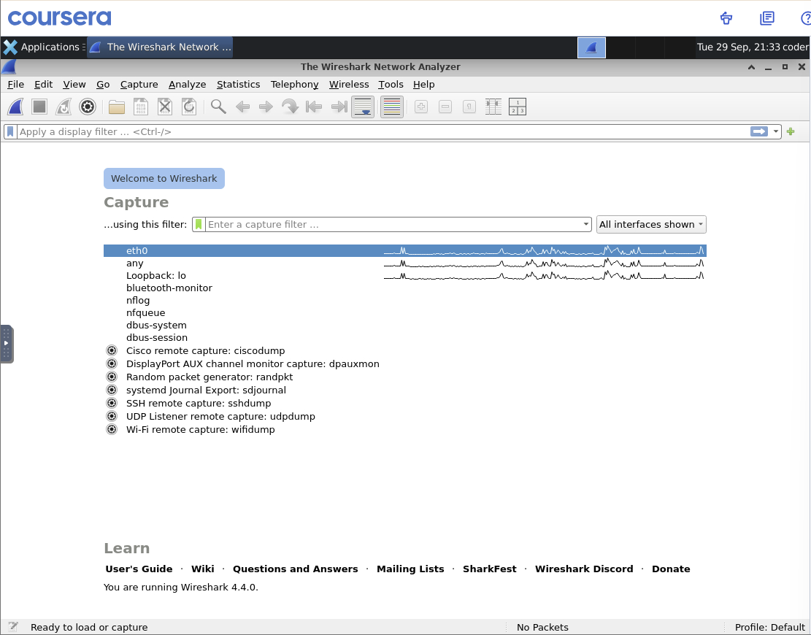
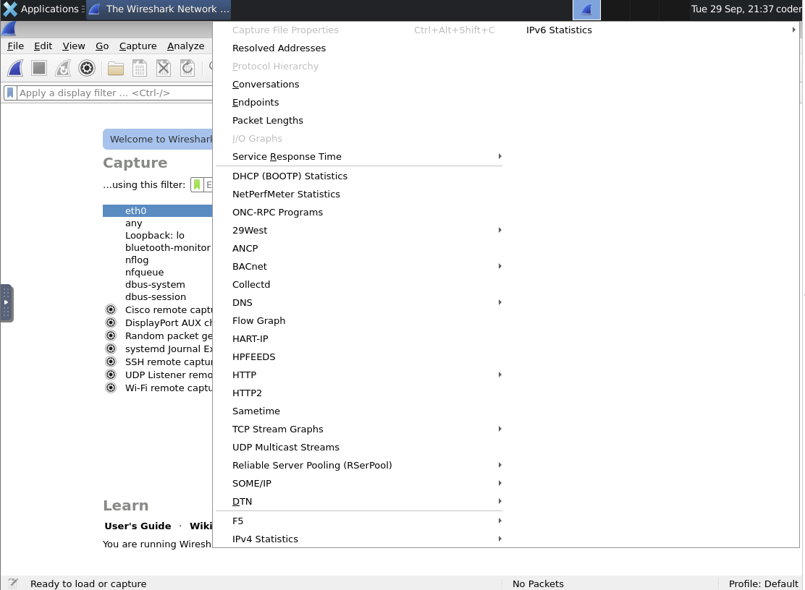
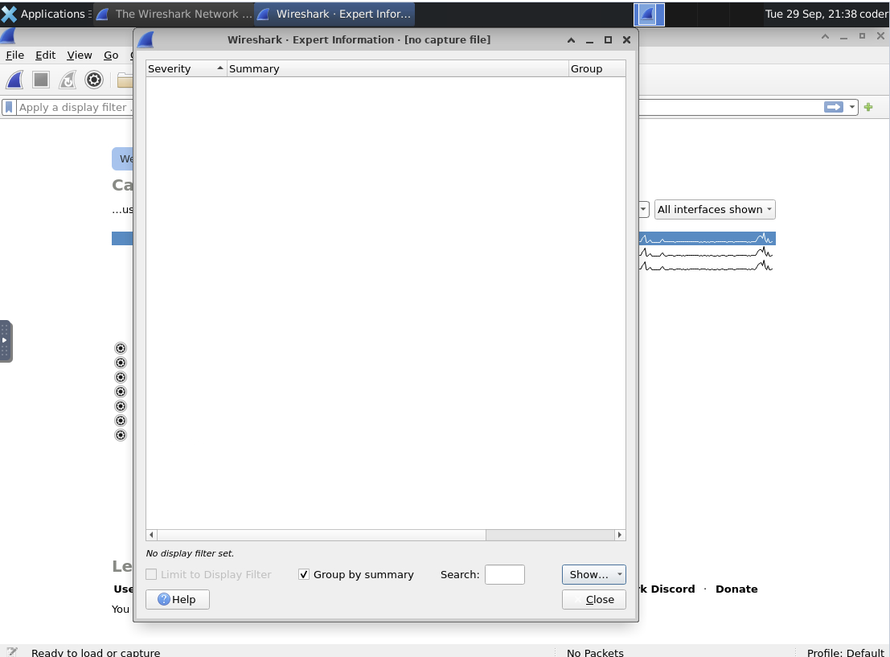

**Why this matters for an analyst:** Analysts start with summaries to decide *where* to look,
then zoom in. It's like triaging a stack of reports before reading any one in depth.

---

## Task 2: Capture and Save Live Traffic

**Goal:** Record a baseline of normal traffic and document it properly.

**Steps I followed:**
1. Double-clicked `eth0` to start capturing.
2. Browsed in the lab desktop, then stopped the capture (**Ctrl + E**).
3. Clicked **File → Save As** and named it `task2-baseline-capture.pcapng` on the Desktop.
4. Opened **Statistics → Capture File Properties** to document what I captured.

**What I saw:**
- **13,865 packets** over **81.4 seconds** (about 170 packets per second), 115 MB,
  **0 dropped**, and no capture filter.
- Wireshark recorded a **SHA256 hash** of the file. It works like a tamper seal on an evidence bag.
- Almost every row was **WebSocket** traffic on port **6901** between `10.0.0.84` and
  `172.18.0.16`. This turned out to be the lab's remote desktop being streamed to my browser:
  - **Big packets (35,000–41,000 bytes):** pictures of the lab screen coming to me.
  - **Small packets (78–82 bytes, marked [MASKED]):** my mouse and keyboard going back.
- A second browser-side address (`10.0.0.53`) also showed up at the very start.

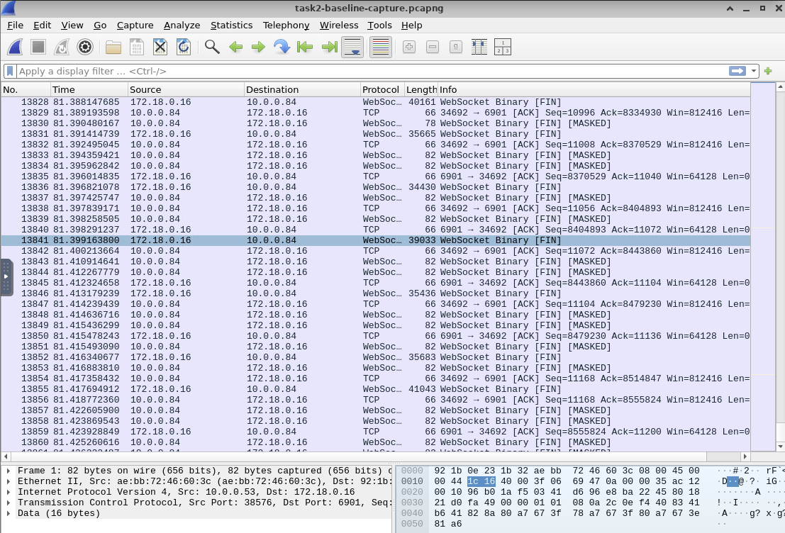
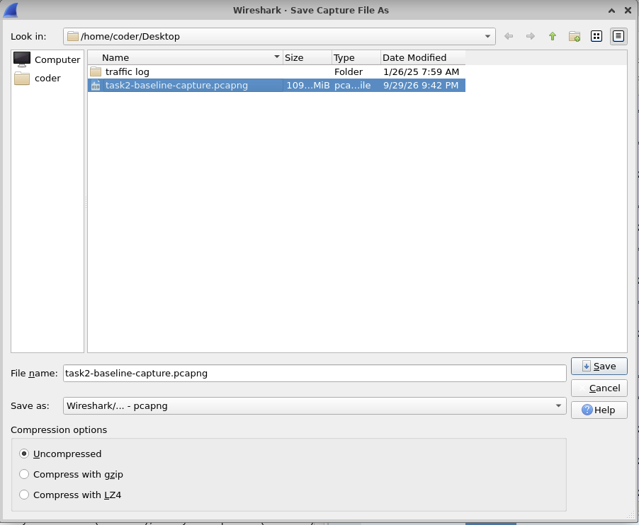
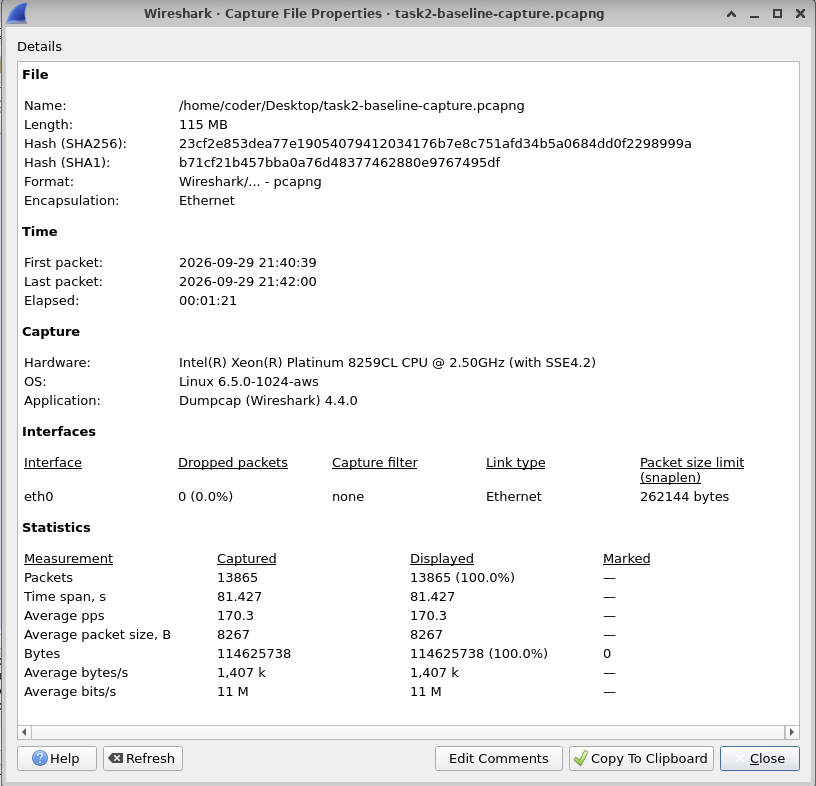

**Why this matters for an analyst:** A capture with a clear name, time range, packet count,
and hash is like properly tagged evidence. Without that, nobody can trust or re-check the findings.

---

## Task 3: Filter Captured Data

**Goal:** Cut thousands of packets down to only what matters.

**Filter symbols I learned:** `==` equals, `!` NOT, `&&` AND (fewer results), `||` OR (more results).

**Steps I followed:**
1. Hid the remote-desktop noise:
```
   !(tcp.port == 6901)
```
2. My baseline had no DNS at all, so I started a **new capture** (`task3-capture.pcapng`,
   25,151 packets), browsed YouTube in Chrome, and filtered by protocol:
```
   dns
```
3. Layered two conditions to show only new connection attempts, with the noise removed:
```
   tcp.flags.syn == 1 && !(tcp.port == 6901)
```
4. For practice, I found only the YouTube lookups, then opened one response to see its answers:
```
   dns.qry.name contains "youtube"
```

**What I saw:**
- Removing port 6901 left only **101 packets (0.7%)**, all **ARP**. The gateway (`172.18.0.1`)
  kept asking for `.45`, `.58`, and `.72` every second and nobody answered, so those lab
  machines were probably offline.
- `dns` → **292 packets.** The lab desktop (`172.18.0.16`) asked the gateway on port **53**.
  Most of the names were Chrome's own background services, not sites I typed.
- Each name got two lookups (**A** and **HTTPS**). The gateway answered the HTTPS ones with
  "Not implemented," so Chrome fell back to A. That's normal, not an attack.
- The layered SYN filter showed **170 packets**: healthy SYN / SYN-ACK pairs on port 443.
  I noticed this filter also caught SYN-ACKs, because they have the SYN flag on too.
- The YouTube filter showed **36 packets.** One response held **24 Google IP addresses**
  (`142.251.x.4`), like a store with 24 checkout lanes.
- In the bytes pane, `00 35` is hexadecimal for **53**, the DNS port. Same number, computer shorthand.

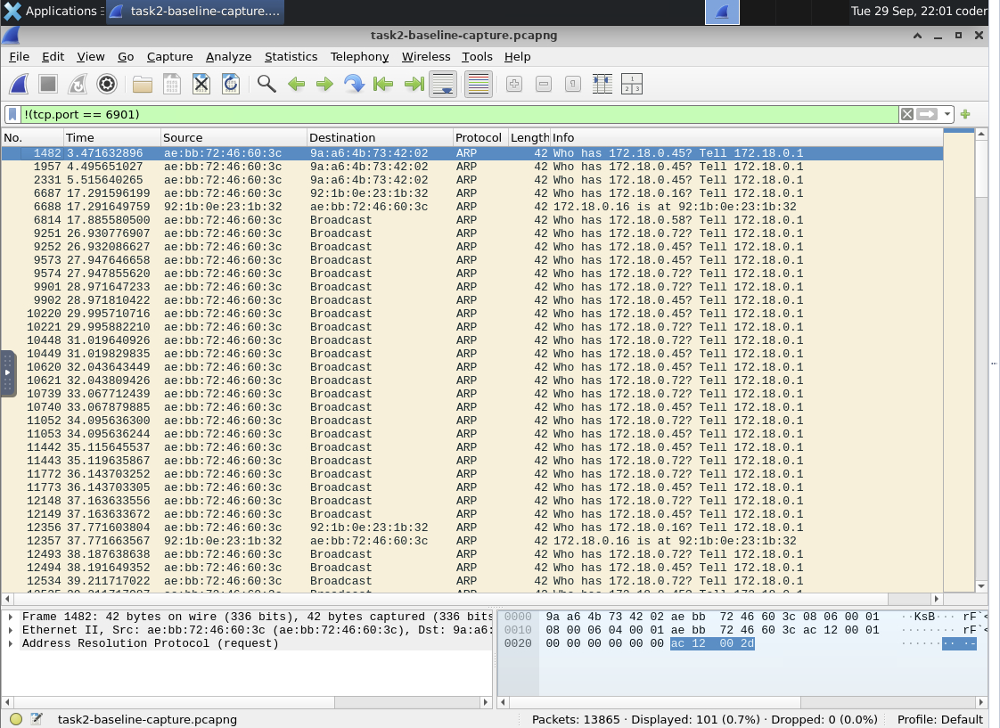
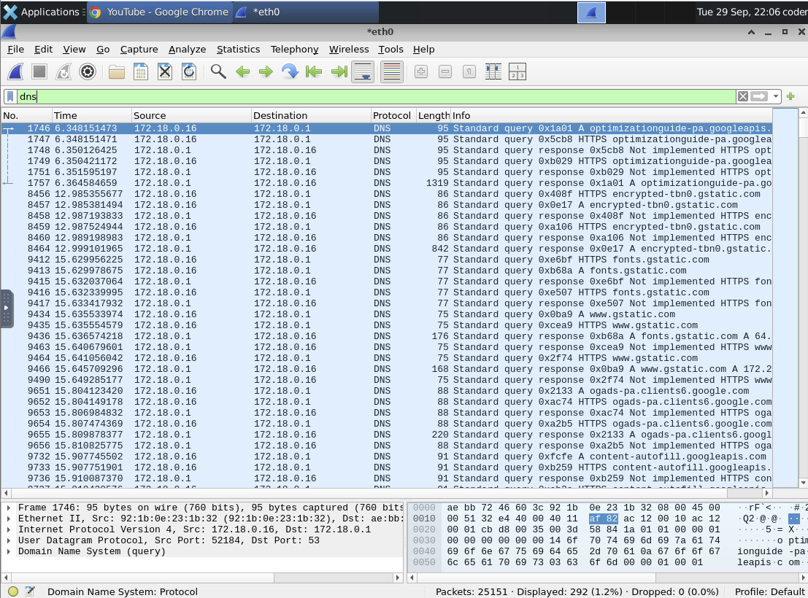
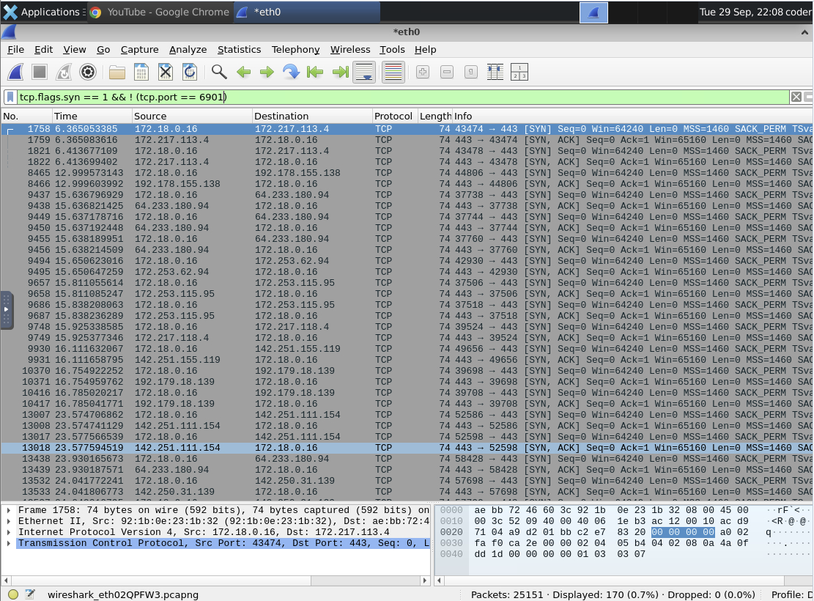
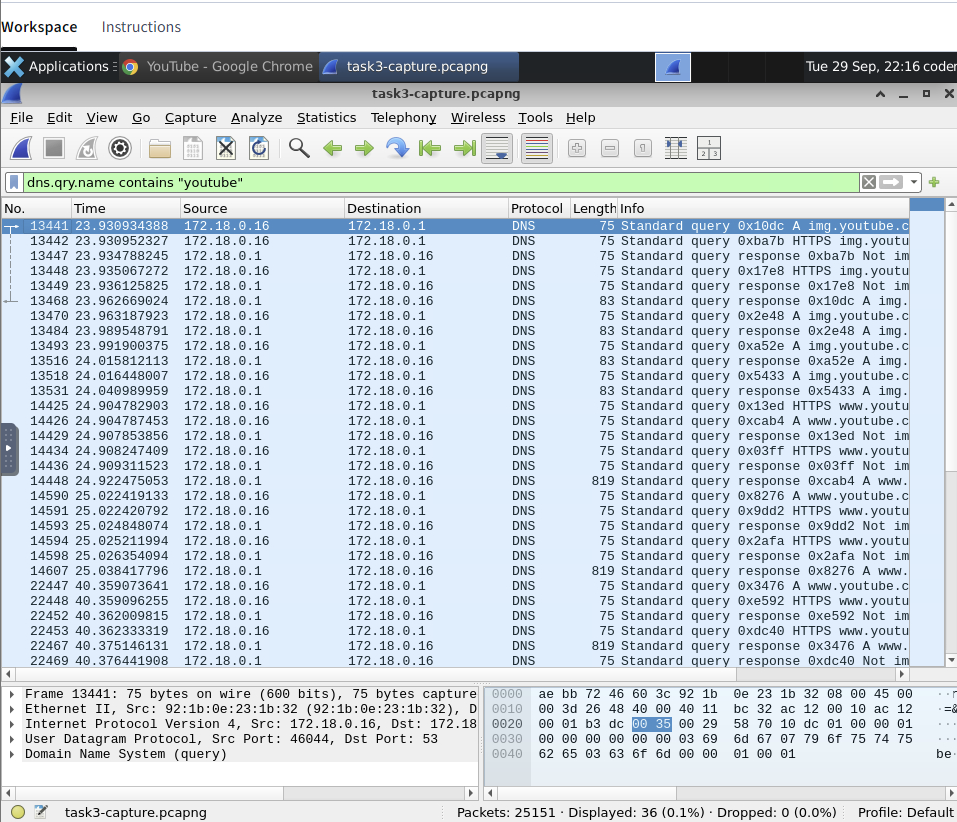
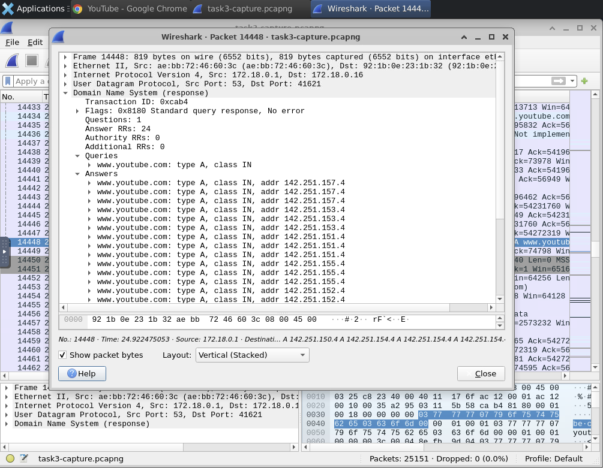

**Why this matters for an analyst:** "Hide the known-good noise, then zoom in" works in any
SIEM tool. Only the syntax changes.

---

## Task 4: Analyze Traffic for Security Threats

**Goal:** Use Wireshark's summary tools to separate normal traffic from suspicious traffic.

**Steps I followed:**
1. **Statistics → Protocol Hierarchy**
2. **Statistics → Conversations → IPv4**, then clicked **Bytes** until the largest was on top
3. **Analyze → Expert Information**

**What I saw:**
- **Protocol Hierarchy:** TCP was **98.4%** of all packets, and encrypted **TLS** was
  **54.8%** of the bytes.
- **Conversations:** the top pair was the screen stream (`172.18.0.16` ↔ `10.0.0.84`,
  **92 MB, 15,194 packets**). I predicted this before checking, and I was right.
- The #2 pair: Google (`172.217.113.4`) sent **78 MB to the lab desktop in 1.3 seconds**.
  That was YouTube delivering video.
- **Expert Information:** **85 SYN** and **85 SYN-ACK**, so every connection request got an
  answer. 85 + 85 = 170, the exact number my layered filter showed in Task 3.
- 60 retransmissions and 8 resets out of about 24,700 TCP packets: normal network hiccups.
- Multicast addresses (`224.0.0.251`, `224.0.0.22`, `239.255.255.250`): normal local announcements.

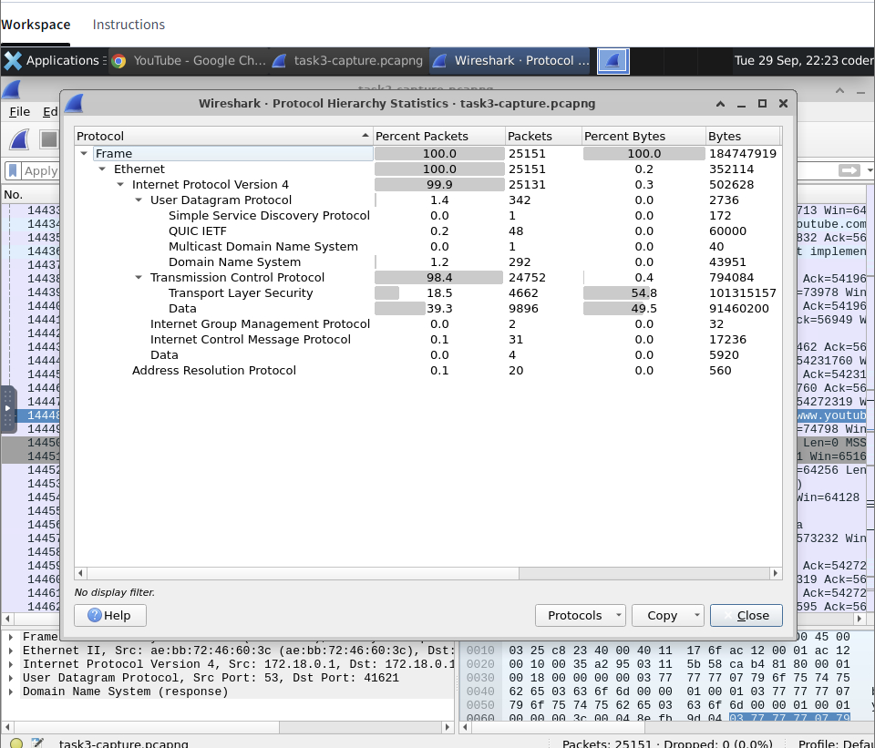
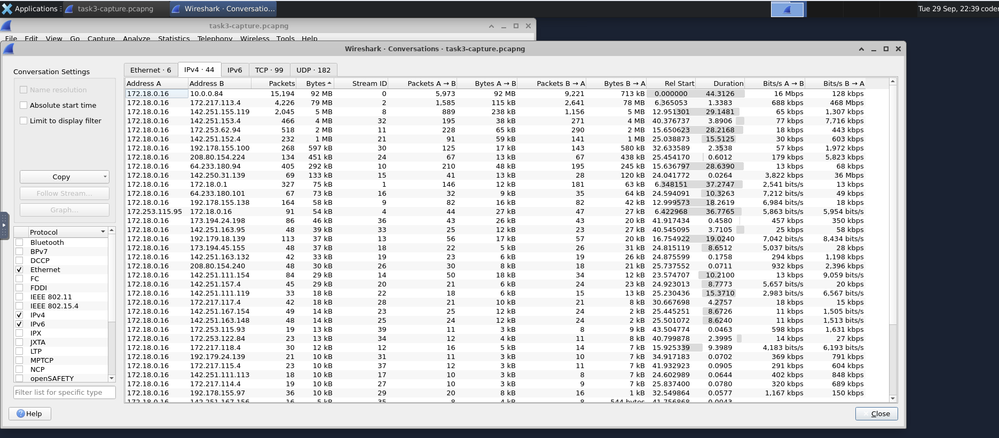
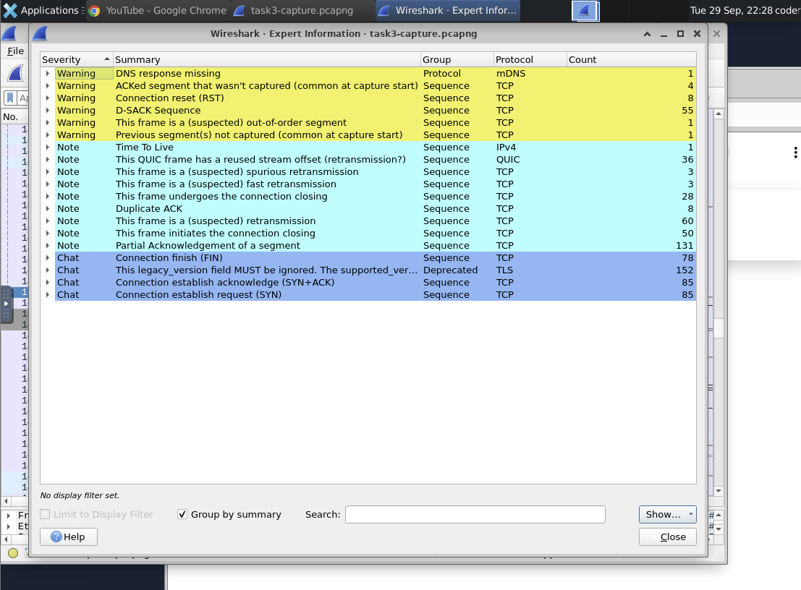

**Why this matters for an analyst:** Loud isn't the same as malicious. And **direction
matters**: 78 MB coming *in* from YouTube is normal, but the same amount going *out* to an
unknown address could be exfiltration.

---

## Task 5: Practical Analysis of a TCP SYN Flood Attack

**Goal:** Prove a SYN flood happened, using several tools that all tell the same story.

**File:** the lab's `scenario2.pcap` (11,065 packets)

**Steps I followed:**
1. Opened the file from **File → Open → Desktop → traffic log**.
2. Filtered for first-step-only handshakes (SYN on, ACK off):
```
   tcp.flags.syn == 1 && tcp.flags.ack == 0
```
3. Clicked packet **1009** and opened **Transmission Control Protocol** in the middle pane.
4. Checked whether anyone replied:
```
   tcp.flags.syn == 1 && tcp.flags.ack == 1
```
```
   ip.src == 192.0.2.1
```
5. Opened **Statistics → I/O Graphs**, **Conversations → IPv4**, and **Endpoints → IPv4**.

**What I saw:**
- The SYN-only filter showed **9,113 of 11,065 packets (82.4%)**.
- **Normal SYNs vs. attack SYNs, side by side:**

| | Normal browsing | Flood |
|---|---|---|
| Source port | Changes every time (59690, 59691...) | Always **20** |
| Destination | Many sites, port 443 | Only `192.0.2.1`, port 80 |
| Window | 65535 | 8192 |
| TCP options | MSS, window scale, timestamps | **None** |
| Packet size | 78 bytes | 54 bytes |

- Wireshark flagged the flood as **[TCP Port numbers reused]** and colored it black with red text.
- In packet 1009's details, Wireshark said **Conversation completeness: Incomplete, SYN_SENT**.
  The handshake never finished.
- The SYN-ACK filter showed **20**, all from normal websites. `ip.src == 192.0.2.1` showed **0**.
  The target never replied.
- `192.0.2.1` is a reserved documentation address (TEST-NET-1), so this was a simulated target.
- **I/O Graph:** near zero, then a wall from about **12 to 17 seconds**, peaking near
  **1,950 packets per second**.
- **Conversations:** `192.168.1.56` → `192.0.2.1`: **9,095 packets, all in one direction**,
  only **491 kB**.
- **Endpoints:** `192.168.1.56` sent 9,670 packets. `192.0.2.1` received 9,095 and sent **0**.

**My finding:** Between roughly 11.7 and 17 seconds, internal host `192.168.1.56` sent about
9,095 SYN packets to `192.0.2.1` on port 80, all from source port 20, at a peak of about 1,950
per second. The target never replied, and no handshake completed. One sender means this was
a **DoS, not a DDoS**.

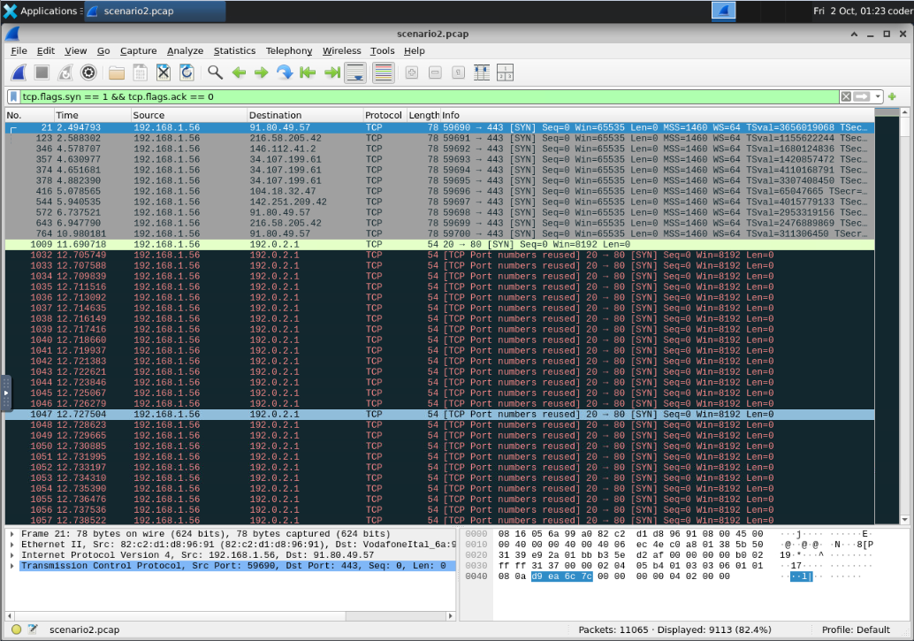
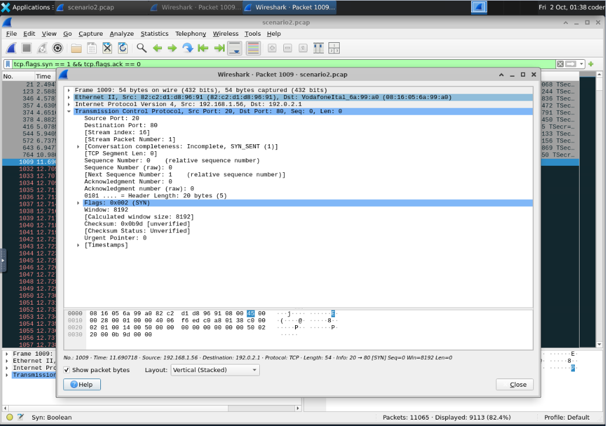
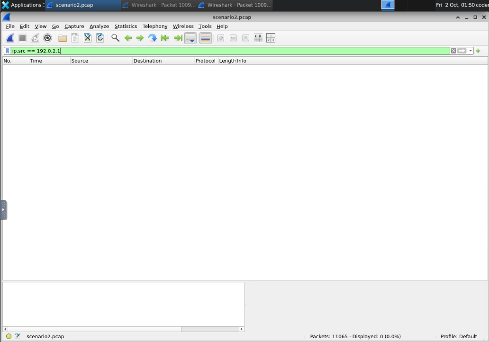
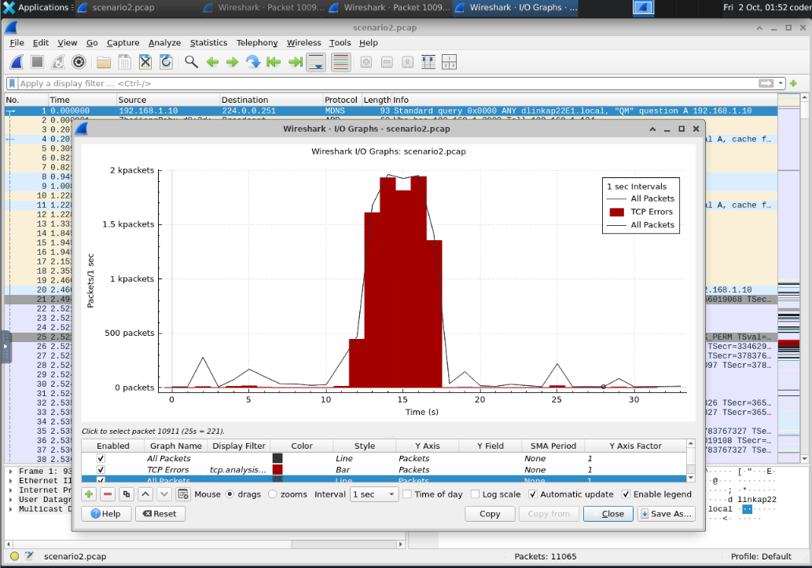
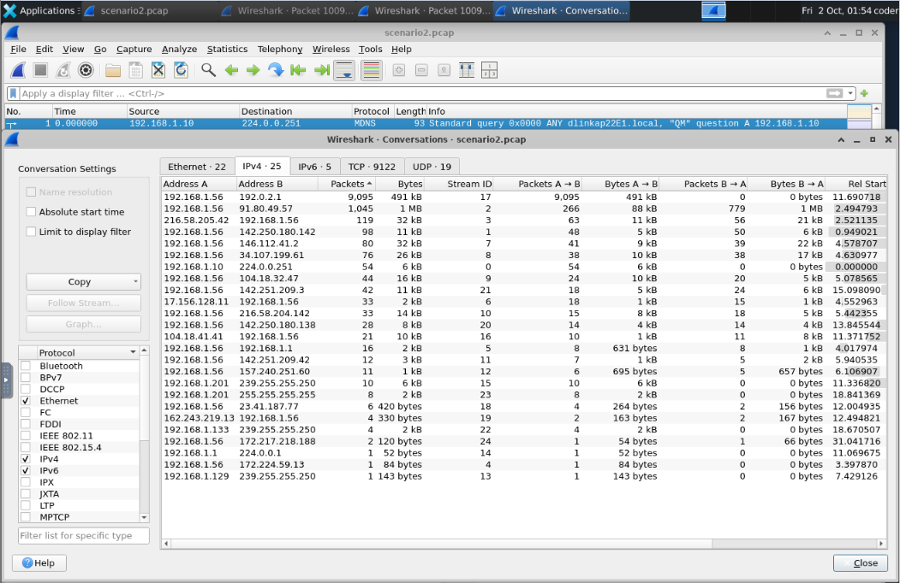
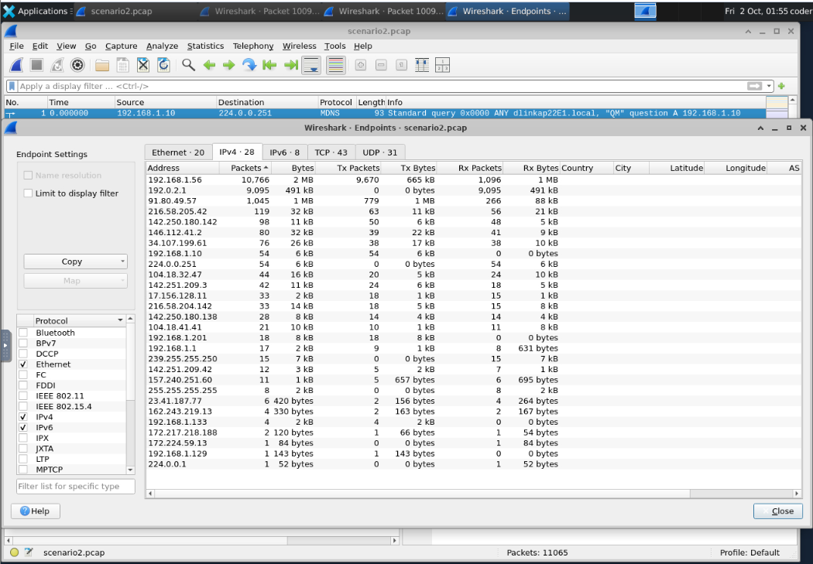

**Why this matters for an analyst:** The sender is a **private (internal) address**, so the
attack came from inside the network: an insider or a compromised machine. The fix is to find
and isolate that computer, not just block the internet.

---

## Filters Cheat Sheet

| Filter | What it does |
|---|---|
| `!(tcp.port == 6901)` | Hides traffic on port 6901 (the lab's remote-desktop noise) |
| `dns` | Shows only DNS (phone book) lookups |
| `dns.qry.name contains "youtube"` | Shows DNS lookups for names containing "youtube" |
| `tcp.flags.syn == 1 && !(tcp.port == 6901)` | Connection starts (and replies), noise removed |
| `tcp.flags.syn == 1 && tcp.flags.ack == 0` | Only first-step connection requests (SYN floods show up here) |
| `tcp.flags.syn == 1 && tcp.flags.ack == 1` | Only replies to connection requests (SYN-ACK) |
| `ip.src == 192.0.2.1` | Only packets sent *by* that address |

---

## What I Learned: My Notes

### Tool basics
- The security summary tools live under **Statistics** and **Analyze → Expert Information**.
- Packet 1 isn't always the interesting one. In the SYN flood file it was an mDNS broadcast,
  so I had to filter first.
- Clicking a column header twice flips the sort order (largest first).

### Normal vs. abnormal
- Healthy TCP: every SYN gets a SYN-ACK (85 = 85 in my own traffic).
- SYN flood: thousands of SYNs, one target, zero replies, identical packets.
- **Floods are about packet count, not size.** 79 MB of YouTube was harmless. 491 kB was an attack.

### Interesting finds
- **The loudest traffic was me:** the lab's screen stream topped every chart and was completely harmless.
- **Offline hosts:** the gateway kept asking for three lab machines that never answered.
- **Two tools, same number:** my layered filter (170) matched Expert Information (85 + 85).
- **Wireshark said it plainly:** the attack packet was marked "Incomplete, SYN_SENT."

### Knowledge checks I answered
- **What does a SYN flood look like?** High volume aimed at one destination. Partly right.
  I also learned the key sign is that the handshakes never complete.
- **Would `||` show more or fewer packets than `&&`?** More, because OR is more inclusive.
- **Is the top talker automatically malicious?** No. With a hint, I identified the lab's
  screen stream as heavy but harmless.
- **DoS or DDoS?** DoS, because there was one source (`192.168.1.56`).

### Mistakes I made (and what fixed them)
- I browsed before my capture was really recording, so my baseline had no DNS. I re-captured.
  **Lesson:** start capturing first.
- My Conversations list was sorted smallest-first. I clicked the header again.
- My Task 3 SYN filter also caught SYN-ACKs. In Task 5 I added `tcp.flags.ack == 0` to fix it.
- The lab's file names didn't match my uploaded copies. I confirmed which file was which by
  comparing packet 1. **Lesson:** make sure I'm analyzing the file I think I am.
