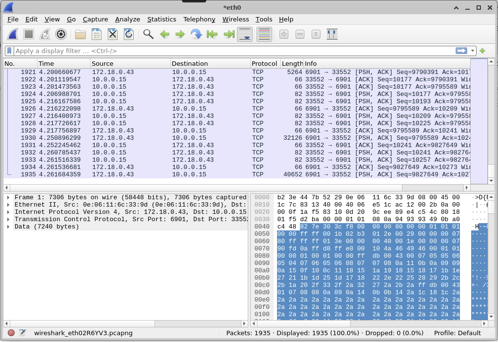
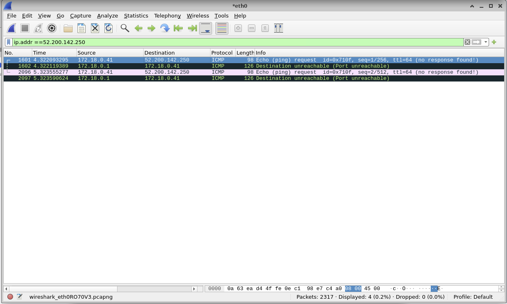
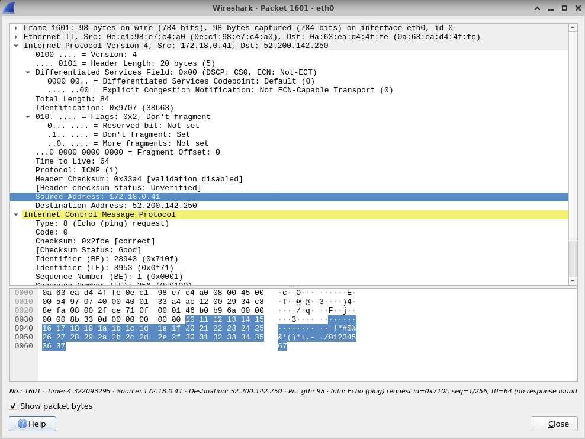
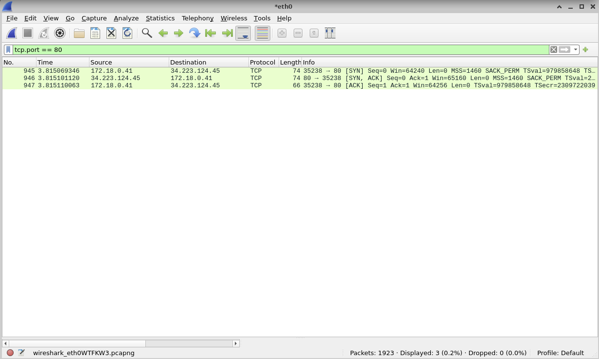
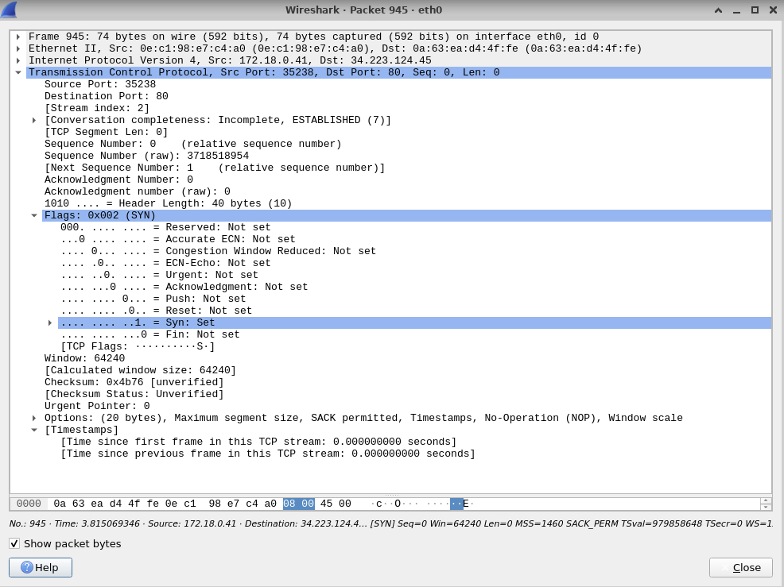
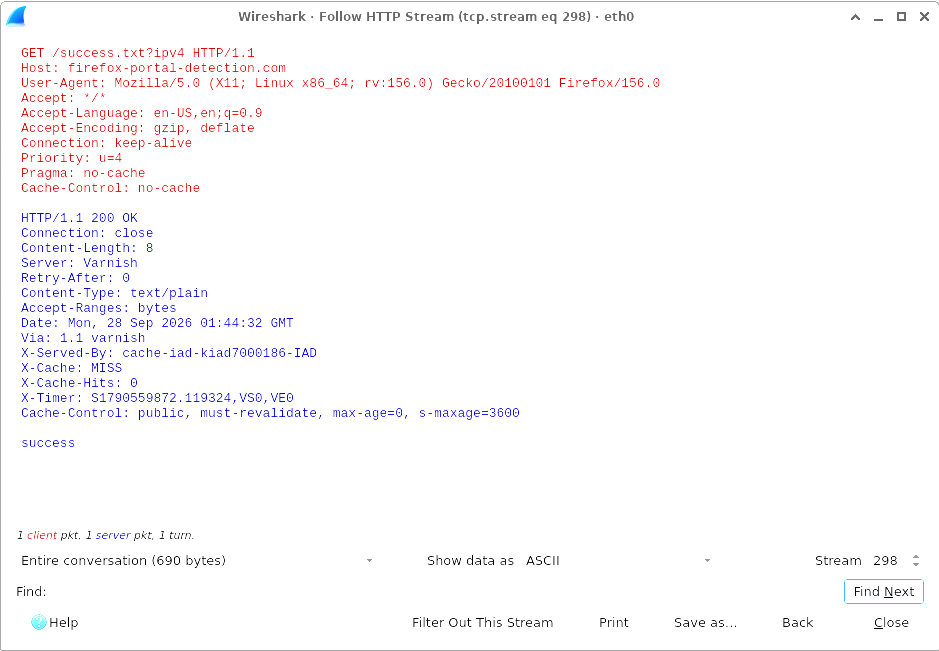
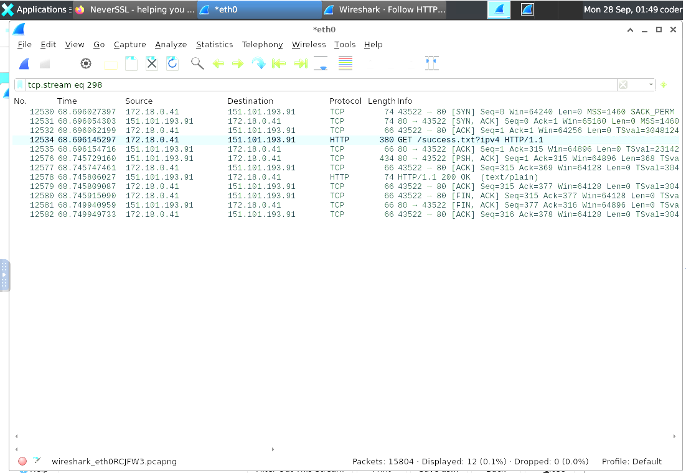
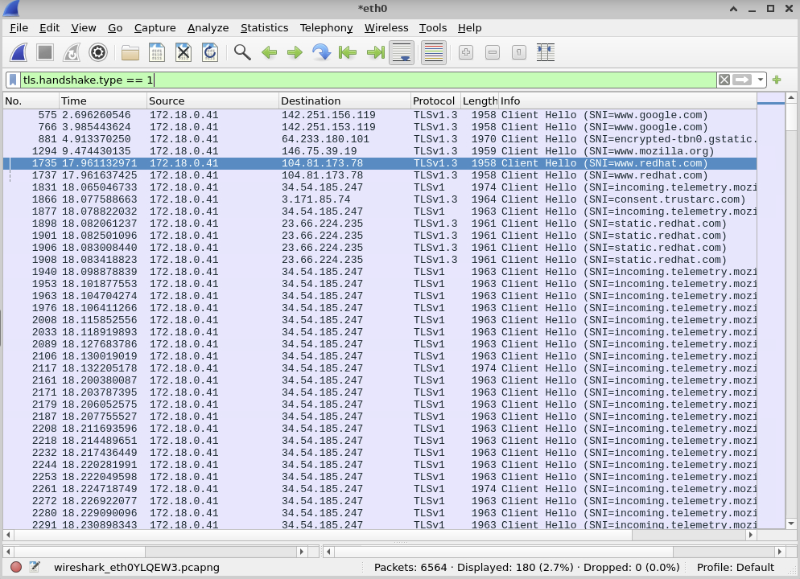
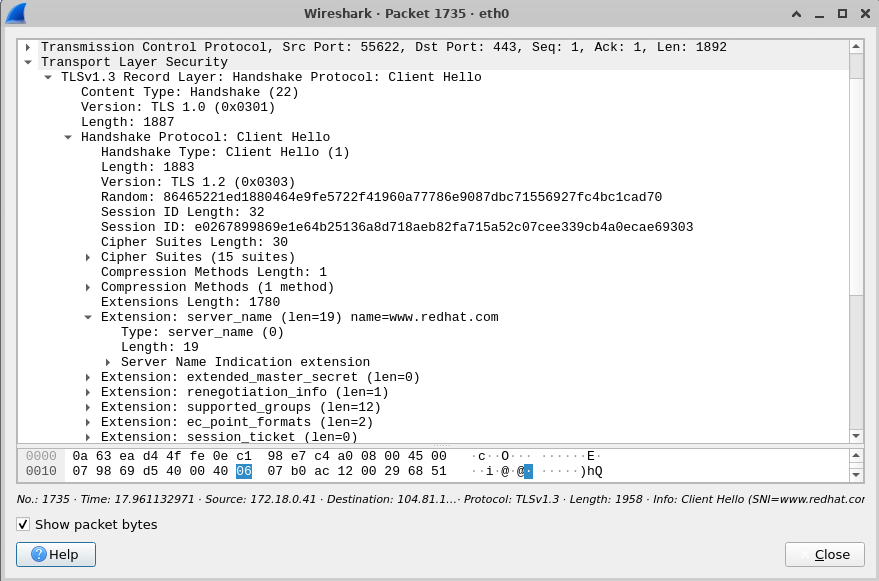
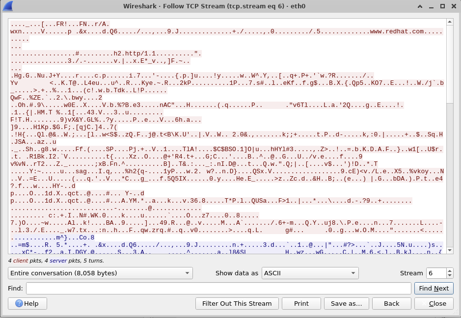

# Wireshark for Beginners: TCP/IP Protocol Fundamentals

**Course:** Coursera Guided Project (September 2026)
**Certificate:** [View verified certificate] (https://coursera.org/share/76028b89a8156cd64a0ad1b2ba337f2e)
**Tools:** Wireshark 4.2.5, Ubuntu 22.04 (cloud lab desktop), Terminal, Firefox
**My level:** First time using Wireshark

## Why I Did This Project
I'm building hands-on cybersecurity skills as I work toward a cyber intelligence analyst
role. This was my first time capturing and reading network traffic. I wrote this page as
a record of what I did, step by step, so I can repeat it later, and as a place to keep
everything I learned along the way.

## Quick Glossary (terms I had to learn first)
- **Packet:** a small chunk of data. Everything sent over a network is split into packets.
- **IP address:** like a building's street address. It gets data to the right computer.
- **Port:** like an apartment number. It gets data to the right program on that computer.
- **Interface:** the "door" a computer uses to connect to a network.
- **Capture:** Wireshark recording a copy of every packet passing through an interface.
- **Display filter:** a search rule that hides packets that don't match (nothing is deleted).
- **Client:** the computer that starts a conversation. It uses a random, high port number.
- **Server:** the computer that answers. It waits on a fixed port (80 for HTTP, 443 for HTTPS).

## The Wireshark Screen (how to read it)
- **Top section (Packet List):** one row per packet: number, time, source, destination,
  protocol, length, and a short summary (Info).
- **Middle section (Packet Details):** click a packet to see its layers. Click the small
  triangles to open each layer.
- **Bottom section (Packet Bytes):** the raw data. I mostly ignored this, except for a
  couple of clues noted below.
- **Filter bar:** turns **green** when a filter is typed correctly and **red** when there's
  a typo. You must press **Enter** to apply it.
- **Status bar (bottom):** shows total packets and how many are displayed after filtering.

---

## Task 1: Start a Packet Capture and Save It

**Goal:** Record live network traffic on the wired interface and save it to a file.

**Steps I followed:**
1. Opened Wireshark in the lab desktop. I did **not** use `sudo` (see notes below for why).
2. On the Welcome screen, I looked at the list of interfaces. Each has a small squiggly
   line showing activity. Only `eth0`, `any`, and `lo` were active.
3. The course said to look for an interface starting with `en` (like `ens5`). Mine was
   named **`eth0`** instead. Both names mean wired ethernet; Linux just names them
   differently on different systems.
4. Double-clicked **`eth0`** to start capturing. Packets started scrolling.
5. Let it run for 10–15 seconds, then clicked the **red square** to stop.
6. Saved with **File → Save As**, named it `task1-capture`, kept the **pcapng** format.
7. Checked that the asterisk in the title bar (`*eth0`) was gone. That's how you know it saved.

**What I saw:**
- My capture recorded **1,445 packets** with **0 dropped**.
- Almost all of it was traffic between **172.18.0.41** and **10.0.0.74** on **port 6901**.
  This turned out to be the lab desktop streaming its screen to my browser.
- In the raw bytes I spotted the letters **`JFIF`**, the signature of a JPEG image. That
  confirmed the traffic was pictures of my lab screen.



---

## Task 2: Use Ping and a Display Filter to Look at the IP Layer

**Goal:** Find one website's IP address, then filter Wireshark to show only its traffic.

**Steps I followed:**
1. Started a new capture on `eth0` (blue shark fin button).
2. Opened the **Terminal** in the lab desktop.
3. My first try was just `ping`, which gave the error *"Destination address required."*
   Ping needs to know **where** to send the knock.
4. Typed `ping -c 4 redhat.com` and pressed **Enter**.
   - `-c 4` means "send 4 pings, then stop." (Without it, press **Ctrl + C** to stop.)
5. The first line showed redhat.com's IP address in parentheses: **52.200.142.250**.
   (The course example used 8.43.85.97. Websites can change IPs, so use your own result.)
6. All 4 pings failed with **"Destination Port Unreachable"** from **172.18.0.1** and
   **100% packet loss**. The lab's gateway was blocking ping. That wasn't my mistake,
   and I still had everything I needed.
7. Stopped the capture and typed this filter, then pressed **Enter**:
   ```
   ip.addr == 52.200.142.250
   ```
8. The display dropped from **2,317 packets to 4**: two ping requests and two rejections.
   (Only 2 of my 4 pings were captured because I stopped the capture early.)
9. Double-clicked packet **1601** to open it and expanded **Internet Protocol Version 4**.

**What I found inside the IP section:**
- **Source Address:** 172.18.0.41 (my lab computer)
- **Destination Address:** 52.200.142.250 (redhat.com)
- **Time to Live:** 64
- **Protocol:** ICMP (1)
- In the ICMP section: **Type 8 = Echo (ping) request**




---

## Task 3: Watch the TCP Three-Way Handshake

**Goal:** See how two computers "shake hands" before sending web data.

**The handshake in plain English (like starting a phone call):**
1. **SYN:** "Hello, can you hear me?"
2. **SYN, ACK:** "Yes, I hear you. Can you hear me?"
3. **ACK:** "Yes, I hear you."

**Steps I followed:**
1. Cleared the old filter by clicking the **X** in the filter bar.
2. Started a new capture.
3. In Firefox, went to `http://neverssl.com` (a site made to use plain HTTP, not HTTPS).
4. Stopped the capture and applied this filter:
   ```
   tcp.port == 80
   ```
5. Found three packets in a row in the Info column: **[SYN]**, **[SYN, ACK]**, **[ACK]**.
6. Clicked the **[SYN]** packet and expanded **Transmission Control Protocol**, then **Flags**.

**What I found:**

| Packet | From → To | Flags |
|---|---|---|
| 945 | 172.18.0.41:**35238** → 34.223.124.45:**80** | SYN |
| 946 | 34.223.124.45:**80** → 172.18.0.41:**35238** | SYN, ACK |
| 947 | 172.18.0.41:**35238** → 34.223.124.45:**80** | ACK |

- **Source Port:** 35238 (random, so my computer is the client)
- **Destination Port:** 80 (fixed web port, so that's the server)
- **Sequence Number:** 0 (Wireshark shows "relative" numbers starting at 0)
- **Flags:** only **Syn: Set**; everything else was "Not set"




---

## Task 4: Watch an HTTP Conversation (Unencrypted)

**Goal:** See the web request (GET), the server's reply, and how the connection closes.

**The conversation in plain English:**
1. **GET:** "Please send me this file or page."
2. **200 OK:** "Here it is."
3. **FIN:** "I'm done, goodbye." (Either side can say it first.)
4. **ACK** after every step: "Got it."

**Steps I followed:**
1. Cleared the filter and started a new capture.
2. In Firefox, loaded the page and pressed **Ctrl + Shift + R** to force a fresh download
   instead of using the browser's saved copy.
3. Waited until the page fully loaded, then waited **10 more seconds** so the goodbye
   (FIN) packets would happen.
4. Stopped the capture and applied the filter `http`.
5. **Right-clicked a `200 OK` row** (not a GET row, so I'd get a conversation that was
   actually answered), then chose **Follow → TCP Stream**.
6. Read the conversation: **red text** is my computer, **blue text** is the server.
7. Clicked **Close** (not Back) so the main window only shows that one conversation.
8. To see only the goodbye packets, I used this filter (replace N with the stream number
   shown in the Follow window):
   ```
   tcp.stream eq N && tcp.flags.fin == 1
   ```

**Backup method if the website doesn't answer:** start the capture, then in the Terminal
type `curl http://example.com`. It makes one clean web request with no browser noise.

**What happened (it took a few tries):**
- My first attempts sent several GET requests to NeverSSL that were **acknowledged but
  never answered**. The Follow window showed "1 client pkt, 0 server pkts."
- The conversation I used was **Firefox's automatic internet check**
  (`firefox-portal-detection.com`). It showed the **entire life of a connection in 12 packets**:

| Packets | What happened |
|---|---|
| 12530–12532 | Three-way handshake |
| 12534 | GET /success.txt |
| 12535 | Server ACK ("got your request") |
| 12576–12578 | 200 OK (text/plain) |
| 12580 | FIN from my computer (client said goodbye first) |
| 12581 | FIN from the server |
| 12582 | Final ACK |

- Everything was readable in plain text, including my browser and OS
  (Firefox 156 on Linux) and the file contents: the word **"success."**




---

## Task 5: Watch the HTTPS / TLS Handshake (Encrypted)

**Goal:** See how HTTPS sets up encryption, and compare it to plain HTTP.

**The big idea:** HTTP is like a **postcard**, and anyone handling it can read it. HTTPS is
like a **locked box**. Before sending anything, both sides agree on a lock. That agreement
is the **TLS handshake**, and it happens right after the TCP handshake.

**The TLS handshake in plain English:**
1. **Client Hello:** "Here are the types of locks I know how to use."
2. **Server Hello:** "Let's use this one. Here's my part of the key."
3. **Change Cipher Spec:** "From now on, everything is locked."
4. **Application Data:** the actual web page, now scrambled.

**Steps I followed:**
1. Cleared the filter and started a new capture.
2. In Firefox, went to `https://www.redhat.com` (note the **https**).
3. Stopped the capture and applied this filter (type 1 = Client Hello):
   ```
   tls.handshake.type == 1
   ```
4. Found the row that said **`Client Hello (SNI=www.redhat.com)`**.
5. Right-clicked it, chose **Follow → TCP Stream**, and saw only **scrambled gibberish**.
   That's encryption working.
6. Clicked **Close**, maximized the Wireshark window (the **□** button) so the middle
   section was visible, then double-clicked packet **1735**.
7. Expanded **Transport Layer Security → Handshake Protocol: Client Hello**.

**What I found:**
- One visit to redhat.com created **180 Client Hellos** because the page pulled content
  from Google, Mozilla, cookie-consent tools, and more.
- The redhat.com conversation (stream 6) on port **443**:

| Packets | What happened |
|---|---|
| 1732–1734 | TCP three-way handshake |
| 1735 | Client Hello |
| 1749 | Server Hello + Change Cipher Spec + Application Data (all in one packet) |
| 1754 | My computer's Change Cipher Spec |
| 1756 on | Encrypted Application Data |
| 1764 | FIN |
| 1767 | RST (shown in red) |

- Inside the Client Hello: **Handshake Type: Client Hello (1)**, a **Random** value,
  **15 Cipher Suites** offered, and **Extension: server_name = www.redhat.com**.





---

## Display Filter Cheat Sheet

| Filter | What it shows |
|---|---|
| `ip.addr == X` | Packets where X is the sender **or** receiver |
| `tcp.port == 80` | HTTP web traffic |
| `tcp.port == 443` | HTTPS web traffic |
| `http` | Only HTTP requests and responses |
| `icmp` | Only ping-type traffic |
| `tls.handshake.type == 1` | Only TLS Client Hellos |
| `tcp.stream eq N` | Only one conversation |
| `tcp.stream eq N && tcp.flags.fin == 1` | Only the goodbye packets in one conversation |

---

## What I Learned: My Notes

### Wireshark basics
- Wireshark should **not** be run with `sudo`. It reads data sent by other machines, and if
  a malicious packet exploits a bug while Wireshark runs as the superuser, the attacker
  could take over the whole system.
- Wireshark has two filter types: **capture filters** (decide what gets recorded) and
  **display filters** (decide what you see from what was recorded).
- An **asterisk** in the title bar means the capture isn't saved yet. Unsaved captures sit
  in a temporary file that gets deleted when Wireshark closes.
- Typing a filter doesn't apply it. You have to press **Enter**.
- **Double-clicking** a packet opens it in its own window, which is easier to read.
- If the middle (details) section is missing, the window is too small or something is
  covering it. Maximize Wireshark.
- In the Follow Stream window, **Close** keeps the conversation filter and **Back**
  removes it.
- Filters can be combined with `&&`, which means "and."
- Wireshark colors packets automatically: **black rows** flag errors, **red rows** are
  RST (abrupt hang-ups).

### Interfaces
- Interface names vary: `eth0` (older style) and `ens5` (newer style) are both wired ethernet.
- `lo` (loopback) is the computer talking to itself. `any` combines all interfaces.
- `nflog` and `nfqueue` are hooks into Linux's firewall. `dbus` carries messages between
  programs inside the computer and isn't network traffic.
- The squiggly activity lines on the Welcome screen show which interfaces are live.

### IP addresses and ports
- Addresses starting with `10.` and `172.16`–`172.31` are **private** (internal) addresses
  that never appear on the public internet.
- A **server** is like a pizza shop with a permanent phone number (fixed port). A
  **client** is like a customer calling from any phone (random port).
- In the Info column, `33552 → 6901` means "from port 33552 to port 6901," in the same
  order as the Source and Destination columns.
- Reading ports tells an analyst **who started a conversation and who answered**.
- **DNS** works like a phone book: it turns a name (redhat.com) into an IP address.
- A **gateway** is the network's exit door to the internet. In my lab it was 172.18.0.1,
  which also handled DNS lookups and blocked outgoing ping.

### Ping, ICMP, and TTL
- Ping uses **ICMP**, not TCP, so ping packets have no ports.
- ICMP types to remember: **8 = echo request**, **0 = echo reply**, **3 = destination unreachable**.
- "Destination unreachable" plus "100% packet loss" means something **blocked** the traffic.
  It doesn't prove the website is down.
- **TTL (Time to Live)** is a countdown. Each router subtracts 1, and the packet is thrown
  away at 0, so lost packets can't circle forever.
- Default TTL hints at the operating system: **Linux = 64**, **Windows = 128**. TTL is a
  **clue, not proof**. A TTL of 125 would most likely be a Windows machine about 3 hops away.
- Linux ping fills its packets with a counting pattern (`!"#$%&'()*+,-./01234567`).
  Different tools use different fillers, which is another fingerprinting clue.

### TCP
- TCP is **reliable**: it confirms the connection first (handshake), then acknowledges
  every delivery.
- **Flags** are on/off switches in the TCP header. A SYN packet has only SYN turned on.
- **Sequence numbers** work like page numbers so missing data can be noticed.
- **ACK number = the last thing received + 1.** It's a receipt that also says "send this
  next." The SYN counts as one number, which is why the server replied Ack=1.
- An **ACK only means "received,"** not "answered." I saw a server acknowledge a GET
  and never send the page.
- Either side can send the first **FIN**, and both sides acknowledge the goodbye.
- The **Time** column shows seconds since the capture started. Subtracting two times gives
  the **RTT (round trip time)**. Wireshark also calculates it under
  TCP → [SEQ/ACK analysis].

### HTTP
- HTTP is unencrypted. **Follow → TCP Stream** showed the whole conversation in plain text.
- HTTP headers exposed the website (**Host**), my browser and OS (**User-Agent**), and in
  one case the server's software version (**Server: Apache/2.4.68**). Attackers can look up
  known weaknesses for a specific version, so security teams often hide this header.
- `Content-Encoding: gzip` means the page is compressed. **Follow → HTTP Stream** unzips it.
- `Keep-Alive: timeout=5` means the server closes an idle connection after 5 seconds.
- A browser may send **several GETs** if replies are slow. Retries leave a trail.
- A request with `Accept: */*` ("send anything") was a background request, while a real
  page load asks for `text/html`.
- **Ctrl + Shift + R** forces Firefox to reload a page fresh instead of using its saved copy.
- `curl http://example.com` in the Terminal makes one clean web request, which is useful
  for testing.

### HTTPS and TLS
- HTTPS uses port **443**; HTTP uses port **80**.
- The TLS handshake happens **after** the TCP three-way handshake.
- In TLS 1.3, the Server Hello, Change Cipher Spec, and first encrypted data can arrive in
  **one packet**.
- TLS 1.3 **disguises itself** with older version numbers (1.0 and 1.2) because some old
  network equipment breaks on version numbers it doesn't recognize. The real version is in
  the **supported_versions** extension.
- **SNI (Server Name Indication)** shows the website name in plain text even in encrypted
  traffic. I could even spot "www.redhat.com" inside the scrambled Follow Stream text.
- A newer feature called **Encrypted Client Hello (ECH)** is being rolled out to hide the
  website name too.

### Background noise
- The first thing to identify in any capture is **your own traffic**, so you can set it aside.
- Firefox makes automatic requests you never asked for:
  - connectivity checks (`/success.txt`, `/generate_204`)
  - DNS lookups for popular sites like twitter.com and wikipedia.org, to load them faster later
  - lots of **telemetry** (usage reporting) connections to Mozilla
- One page visit can trigger connections to many third parties (ads, consent tools, CDNs).

### Interesting finds
- **Timing exposed a hidden middleman.** My handshake with NeverSSL completed in about
  **32 microseconds**. A signal can only travel about 3 km there and back in that time, so
  a distant server couldn't have answered. Something inside the lab (probably a proxy)
  answered instead. IP addresses can be relayed or faked, but physics can't.
- **Server headers can reveal location.** `X-Served-By: cache-iad-...` pointed to a server
  near **Washington Dulles (IAD)**. Caching companies often name servers after airport codes.
- **`Varnish`** in the headers means a **caching server** (a middleman that stores copies of
  content to serve it faster).
- **File signatures reveal content.** `JFIF` in the raw bytes meant a JPEG image.
- My lab computer's IP changed between sessions (10.0.0.15 → 10.0.0.74), so always
  re-check addresses.

### Questions I asked
- **How do I post a project to GitHub?** Use Add file → Create new file. Typing a slash
  in the file name creates a folder. Upload screenshots with Add file → Upload files.
- **Where are the ports on the screen?** In the Info column: the two numbers around the
  arrow (→).
- **Where is the time that showed the handshake was too fast?** In the Time column of the
  main packet list, not inside the packet. Subtract one packet's time from the next.
- **Why can't I see Transport Layer Security?** The Follow window was covering it and the
  Wireshark window was too small. Close the Follow window and maximize Wireshark.
- **Did I not wait long enough?** Not exactly. The server never answered
  ("0 server pkts"). Retry, and start capturing before loading the page.

### Knowledge checks I answered
- **Which IP is the server?** The one using the fixed port (like 6901 or 80), not the random
  high port. (after working through it)
- **In `51234 → 80`, which number belongs to the server?** 80. 
- **What TTL did my ping show?** 64, which matches Linux. 
- **What is a device with TTL 128 likely to be?** Windows. 
- **Why does the server say Ack=1?** Partly right: I said it's waiting for the client's
  ACK. The full answer is that Ack = last number received + 1, and the SYN counted as 0.
- **Who sent the first FIN when the server never answered?** My lab computer. 
- **With `Keep-Alive: timeout=5`, who sends the first FIN?** I predicted the server. 
  The evidence showed my computer sent it first, with the server 0.4 ms later.
  **Lesson: confirm predictions with evidence before writing them down as fact.**
- **Why does it matter that SNI is readable?** A security team can see **where** someone
  went but not **what** they sent (passwords stay encrypted). Defenders use it to spot
  malware contacting bad domains. The downside is privacy: internet providers and Wi-Fi
  owners can see which sites you visit. 

### Mistakes I made (and what fixed them)
- Typed `ping` with no website, which caused an error. Ping needs a destination.
- Typed a filter but didn't press **Enter**, so it wasn't applied.
- Loaded the web page before starting the capture, so the request was missed. **Start the
  capture first**, then load the page.
- Followed a GET that never got answered. Follow the **200 OK** row instead.
- At first we assumed the wrong IP was my lab computer. The ping traffic proved my machine
  was **172.18.0.41**. Evidence beats assumptions.
